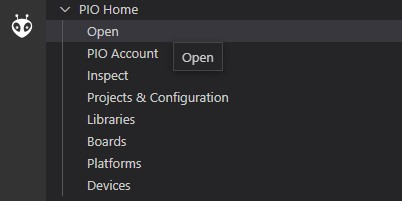
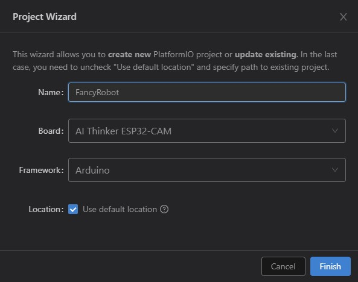
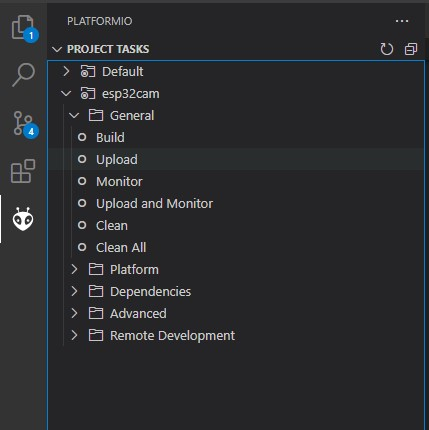
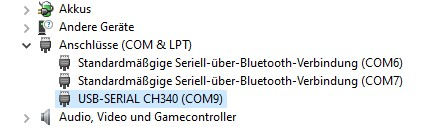

# fhnw-esp32-cam-robot


## ❗❗❗ Wichtig

- Die Motoren niemals in beide Richtungen gleichzeitig ansteuern!
  - Gegenseitige Verriegelung durch funktion im code
- Den Servo nur mit Werten zwischen `SERVOMIN` (200) und `SERVOMAX` (400) ansteuern
- Die LED (sofern keine Dimmung mittels PWM) nur kurz einschalten, sie wird sehr schnell sehr heiss und könnte das Board zerstören.

## Funktion

### PWM Modul

Das PWM Modul wird über I2C angesteuert. Es gibt 16 Kanäle, wovon folgende belegt sind:

channel | actuator
-|-
0 | Right Wheel Backwards
1 | Right Wheel Forward
2 | Left Wheel Backwards
3 | Left Wheel Forward
4 | Servo
5 | Buzzer

### Ansteuerung 

Verbindung auf ESP-Cam via WiFi
- AP oder Station Mode
- Bei AP Mode ist die default IP `192.168.4.1`

Webserver
- UI auf Port 80
- JPEG-Stream auf Port 81

### Kameraparameter
- werden im `setup()` gesetzt:
    ```c++
    config.frame_size = FRAMESIZE_VGA; // 640x480
    config.jpeg_quality = 10; // 4 = best
    ```

## Setup

- USB Driver
  - Möglicherweise muss der Treiber für den CH340 Chip auf dem PC installiert werden. Eine Anleitung ist [auf makershop.de](https://www.makershop.de/ch340-341-usb-installieren/) zu finden.

- Installation PlatformIO
  - [Als extension zu VSCode hinzufügen](https://platformio.org/install/ide?install=vscode)

- Erstellen eines PlatformIO Projekts
  - PIO Home öffnen
  - 
  - New Project, Board &rarr; `AI Thinker ESP32-CAM`
  - 

- Build & Upload der Applikation
  - Über PIO Tab:
  - 
  - Der COM Port sollte automatisch erkannt werden. Alternativ kann er über den Geräte Manager gefunden werden (Windows) und im File [platformio.ini](platformio.ini) ergänzt werden:
  - 


## Zusätzliche Resourcen

Pinout:


* [Arduino IDE Setup](https://randomnerdtutorials.com/installing-the-esp32-board-in-arduino-ide-mac-and-linux-instructions/)